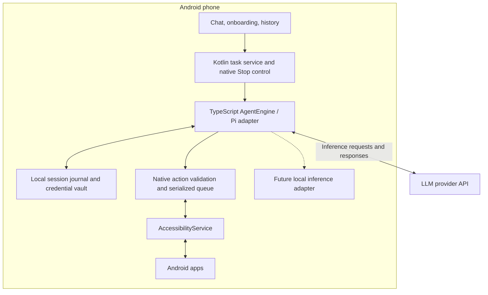

# Android Use — research and implementation plan

Research date: 22 September 2026. Historical proposal: this file records the initial research. The implemented v0.1 app uses native Kotlin after the user clarified that framework choice is flexible and prompt caching is the priority. See README.md and docs/TESTING.md for shipped behavior and validation; future milestones below are not claims of implemented features.

Build a standalone Android app whose agent runtime, tool execution, task state, and history live on the phone. Initially, the phone calls an LLM provider directly using the user's API key. Later, a local inference adapter can replace that connection without changing the phone tools.

The installed release APK must work without ADB, root, Termux, a companion computer, a development server, or an application backend. A computer or CI may build the APK during development; neither is a runtime dependency.

**1. Recommendation**

Use React Native with TypeScript and Hermes for the UI and agent runtime, plus a Kotlin Android module for accessibility, screenshots, gestures, lifecycle, credentials, and persistence. Keep the Android project checked in and directly maintainable. Start with Android 11 / API 30 as the minimum; select the current stable compile/target SDK when scaffolding and test its restrictions explicitly.

Make Pi Agent Core the first runtime candidate, behind an application-owned `AgentEngine` interface. Confirm compatibility in a small release-build experiment before building the product around it. Use one agent engine, one native action queue, and one active phone-control session.

Why this combination: TypeScript makes Pi reuse practical, and Kotlin provides direct control over Android services and accessibility. React Native bundles the JavaScript engine and application code into the installed app; it does not require Node.js or Metro on the user's phone. Hermes is documented by [React Native](https://reactnative.dev/docs/hermes).

Alternatives:

| Approach | Assessment |
| --- | --- |
| React Native + Pi adapter + Kotlin services | Recommended starting point; closest to the proposed Pi-style product. Runtime compatibility and service ownership need an early proof. |
| Kotlin + Compose + a Kotlin agent loop | Strong alternative for an Android-only product if direct Pi reuse is unimportant. Fewer runtime boundaries, but Pi's TypeScript implementation cannot run directly as Kotlin. |
| Fork the whole Deft app | Useful for experiments, but couples the project to its product choices and the implementation issues identified below. |
| Embed a complete Node.js environment | Additional runtime, packaging, and lifecycle complexity without a demonstrated requirement. |

**2. What Deft actually does**

I inspected these source snapshots locally, beyond the README descriptions:

| Repository | Inspected revision | Responsibility |
| --- | --- | --- |
| [Deft](https://github.com/bedda-tech/deft/tree/38bc257466cb43d2df7db85949ed0b803cbdc50b) | `38bc257` | React Native/Expo application, onboarding, chat, settings, task history, model integration, foreground service. |
| [react-native-device-agent](https://github.com/bedda-tech/react-native-device-agent/tree/ae53a6d57e58533e01f0d5d77b1109585a7b337c) | `ae53a6d` | TypeScript observation/action loop, tool registry, screen serialization, model providers. |
| [react-native-accessibility-controller](https://github.com/bedda-tech/react-native-accessibility-controller/tree/133fdaf0a61044e1c899681391b79f1845c9c2ee) | `133fdaf` | Kotlin accessibility service, tree extraction, node actions, gestures, screenshots, overlay. |
| [Pi](https://github.com/earendil-works/pi/tree/d201760ffee16564aa8d9a759e0c85b70db33674) | `d201760` | General agent runtime and model-provider abstractions. The old `badlogic/pi-mono` clone URL resolved to this project. |

Deft's execution path is chat command → `agentBridge` → `AgentLoop` → model provider → registered phone tool → Kotlin accessibility implementation. The loop observes the screen, builds a prompt with history, requests inference, parses tool calls, executes them, and observes again. Its provider boundary supports cloud inference as well as local generation. The app's `buildProvider` also has a cloud-only path, so the basic design does not require a local model. See [agentBridge.ts](https://github.com/bedda-tech/deft/blob/38bc257466cb43d2df7db85949ed0b803cbdc50b/src/agent/agentBridge.ts) and [AgentLoop.ts](https://github.com/bedda-tech/react-native-device-agent/blob/ae53a6d57e58533e01f0d5d77b1109585a7b337c/src/agent/AgentLoop.ts).

Useful ideas to reuse are the separation of device control from orchestration, compact accessibility observations, semantic actions with coordinate gestures available, and a swappable inference provider. Deft's local-model integrations demonstrate an architectural direction; this review did not benchmark their accuracy, speed, or supported phones.

Specific implementation lessons:

- **Element identity needs strengthening.** `ScreenReader` identifies nodes using a window ID plus resource name, falling back to a Java object identity hash. Repeated list rows can share resource names, and wrapper identity is not a durable node reference across fresh traversals. Use snapshot-scoped IDs and explicit target revalidation. See [ScreenReader.kt](https://github.com/bedda-tech/react-native-accessibility-controller/blob/133fdaf0a61044e1c899681391b79f1845c9c2ee/android/src/main/java/com/beddatech/accessibilitycontroller/ScreenReader.kt).
- **A real error must stay a real error.** Deft's bridge catches exceptions from the real-loop path and invokes canned stub behavior. It also labels a step-limit event as a complete outcome in the real-loop handler. This app should distinguish success, failure, interruption, and budget exhaustion, with simulation available only in an explicit development mode. See the bridge linked above.
- **Foreground notification is not sufficient runtime ownership.** Deft has a native foreground service, but its inspected implementation manages notifications and returns `START_NOT_STICKY`; it does not itself bootstrap or recover the JS agent. Build and test explicit runtime startup and interruption handling. See [DeftAgentService.kt](https://github.com/bedda-tech/deft/blob/38bc257466cb43d2df7db85949ed0b803cbdc50b/plugins/android/DeftAgentService.kt).
- **Credentials need separate storage.** The inspected settings store includes `cloudApiKey` in the settings object serialized to AsyncStorage. Keep API keys in encrypted storage backed by Android Keystore instead. See [settingsStore.ts](https://github.com/bedda-tech/deft/blob/38bc257466cb43d2df7db85949ed0b803cbdc50b/src/store/settingsStore.ts).
- **Pin dependencies.** Deft's package manifest points at sibling filesystem checkouts for its three core libraries. A new project needs reproducible dependency resolution and recorded versions. See [package.json](https://github.com/bedda-tech/deft/blob/38bc257466cb43d2df7db85949ed0b803cbdc50b/package.json).

Treat Deft as an implementation reference and selectively reuse audited code with its license notices. Prefer owning the relatively small Kotlin controller boundary rather than inheriting its node identity scheme unchanged. These findings are from source inspection, not a comprehensive audit or device test.

**3. Pi integration**

The inspected upstream package is named `@earendil-works/pi-agent-core`; older material uses `@mariozechner/pi-agent-core`. Pin the selected release or commit and use its matching APIs rather than mixing generations.

Pi supplies customizable tools, message state, event delivery, cancellation, and model-call integration. Its `streamFn`, context transformation, and pre/post-tool hooks are useful integration points. The current implementation defaults to parallel tool execution: explicitly set `toolExecution: "sequential"`, and enforce serialization again in Kotlin. See [Pi's agent documentation](https://github.com/earendil-works/pi/blob/d201760ffee16564aa8d9a759e0c85b70db33674/packages/agent/README.md).

Do not register coding-agent filesystem or shell tools. Register only the phone tools described below. Store device observations as tool results or clearly delimited environment data. Adapt Pi's event stream into application events and persist completed turns through the application's storage boundary.

Pi AI documents browser support, selective provider imports, and Node-only exceptions. That is encouraging, but does not establish React Native/Hermes compatibility. Audit the actual bundled dependency graph, not just top-level TypeScript syntax. The release-build experiment must test Metro resolution, required stream/text/crypto globals, provider networking, image payloads, tool validation, and abort propagation. See [Pi AI browser notes](https://github.com/earendil-works/pi/blob/d201760ffee16564aa8d9a759e0c85b70db33674/packages/ai/README.md#browser-usage).

Use a native HTTP/SSE adapter through `streamFn` if provider streaming needs it. Begin with one provider and one tested model offering tool calling and image input. A non-streaming inference call is an acceptable initial fallback; correct execution matters more than token animation.

If Pi needs extensive Node emulation or a broad permanent fork, retain the same `AgentEngine` interface and implement a small TypeScript agent loop. Reconsider a Kotlin-only stack if service-owned JS execution itself proves unreliable. These are explicit decision gates, not dependencies to defer until after the UI is built.

**4. Component architecture**



The model returns proposed tool calls. Only the phone validates and executes them. Screenshots and screen text may leave the phone as inference input when using a cloud provider; keeping the agent local does not mean those observations remain private to the device.

The native service owns the run ID, cancellation generation, single-controller lock, notification, and runtime startup. A registered background JS task runs the engine independently of React components, using the same application React host rather than creating competing runtimes. Configure execution while the app is visible as well as while another app is open. React Native documents this mechanism as [Headless JS](https://reactnative.dev/docs/headless-js-android).

Start the foreground service when the user starts a task from the visible app. For API levels requiring service types, assess and declare the appropriate type; `specialUse` is the candidate for this use case, with a precise subtype description. It is not an exemption from other Android restrictions. See [service types](https://developer.android.com/develop/background-work/services/fgs/service-types) and [background-start restrictions](https://developer.android.com/develop/background-work/services/fgs/restrictions-bg-start).

The accessibility service handles short native operations and reports observations. It must not perform inference or block its callback thread. Screenshot encoding and storage run off the main thread; gesture completion is asynchronous.

**5. Observation and action contract**

Use structured accessibility data as the default observation. Capture an image when requested, when the tree lacks useful targets, or when visual verification is needed. A model with vision can handle some custom-drawn UIs; screenshots cannot guarantee reliable control of every app.

Each observation includes a unique `snapshotId`, monotonic capture time, foreground package, window/display IDs, physical screen size, rotation, relevant insets, and a bounded tree. Nodes include a short unique reference, parent reference, class, text/description, bounds, visibility, enabled/editable/focused/checked states, and supported actions. Include actionable containers and necessary surrounding labels. Report truncation explicitly.

Example model-facing representation:

```text
snapshot=s42 package=com.example.notes display=0 size=1080x2400
n1 button "New note" clickable bounds=[850,2100,1010,2260]
n2 edit "Title" editable bounds=[40,240,1040,360]
n3 edit "Note body" editable bounds=[40,400,1040,1900]
```

Node IDs are unique only inside their snapshot. Kotlin keeps a short-lived mapping and refreshes/revalidates the target before use, checking window, package, expected attributes, and bounds. Ambiguous or stale targets return an error and request a new observation. Do not silently substitute the first matching label or resource ID.

When returning a screenshot, preserve its transformation to physical display coordinates, including crop offset, scaling, and rotation. Tree and image capture are not atomic: if the window changes between them, recapture or report the mismatch. Filter the app's own control overlay out of observations.

| Initial tool | Behavior |
| --- | --- |
| `observe` | Structured snapshot; optional image and a reference to its coordinate frame. |
| `screenshot` | Image of the current permitted display/window with capture metadata. |
| `tap`, `long_press` | Target a node in a snapshot, or validated screenshot coordinates as fallback. |
| `set_text` | Explicitly replace the text in an editable node; return whether the requested value was observed. |
| `ime_action` | Use a supported input action such as submit/search; report unsupported cases. |
| `scroll` | Prefer a scrollable node's semantic action. |
| `swipe` | Bounded coordinate gesture with duration and coordinate-frame reference. |
| `navigate` | A limited set such as back, home, recents, and notifications. |
| `list_apps`, `open_app` | Discover launchable apps and launch a resolved package. |
| `wait_for` | Bounded wait for a node, screen change, or settled state. |
| `finish`, `request_user_input` | End with evidence or suspend for missing input. |

Implement node actions with Android accessibility actions, and gestures with `dispatchGesture`. Distinguish a dispatched/completed gesture from a verified application result. Text replacement should use `ACTION_SET_TEXT`; a keyboard input service is a later optional feature for fields that do not support it. Never report typing success solely because a request was submitted. See [AccessibilityAction](https://developer.android.com/reference/android/view/accessibility/AccessibilityNodeInfo.AccessibilityAction).

Use launcher-intent queries for app discovery rather than assuming access to every installed package. Android filters package visibility; declare the needed queries and handle unavailable packages or blocked launches explicitly. See [package visibility](https://developer.android.com/training/package-visibility/declaring).

**6. Agent execution and recovery**

The execution cycle is: observe → infer → validate → journal intent → execute one mutation → wait for completion/settling → observe → record result → infer again.

Initially allow only one screen-mutating call per inference turn. Running several calls sequentially still leaves later calls based on a screen the model has not observed. Return explicit results for rejected extra calls so provider transcripts remain valid. Add bounded deterministic composite tools such as scroll-until-found only after basic reliability is measured.

Debounce relevant accessibility events and use a maximum settling deadline; a constantly animated page must not cause an endless wait. Detect repeated observation/action pairs and no-progress loops. Apply per-run action, time, and inference budgets. Finish with observed evidence and distinguish partial completion from success.

Persist sessions and an action journal in native SQLite/Room behind a narrow bridge. Write a pending action record before dispatch and its result after dispatch. Record model/provider, usage, tool arguments, outcome, and observation references; retain raw screenshots only under an explicit retention setting.

External UI actions and database writes cannot be committed atomically. If the process dies after a tap but before recording its result, the result is unknown. Reobserve and reconcile, or ask the user, before any retry that could duplicate a send, purchase, or deletion. Never promise exactly-once effects across arbitrary apps.

On process death, permission loss, screen lock, or service disconnection, transition to an interrupted/paused state. Recover persisted state when the user returns; require a fresh observation before resuming. Force-stop is a stop, not a promise of automatic restart. A foreground service improves survivability but cannot make the app immortal.

Native Stop increments a cancellation generation and invalidates queued actions immediately, even if the LLM request or JS thread is stuck. Abort the request as well. An already dispatched OS gesture may finish; no subsequent action should execute. Pause/resume and task steering use the same run state, with the user's newest instruction retained.

Multiple agents can eventually plan or analyze, but phone interaction must remain serialized through one controller. Start with one agent and a task queue.

**7. Android constraints that shape the product**

Android's accessibility service supports window retrieval, gestures, global navigation, and screenshots. Screenshot capture through this API starts at API 30, which motivates the Android 11 minimum. API 34 adds window-specific capture that can avoid covering the target screenshot with an accessibility overlay. Declare the corresponding capabilities and handle screenshot throttling and secure-window failures. See [AccessibilityService](https://developer.android.com/reference/android/accessibilityservice/AccessibilityService).

Use an accessibility overlay for compact status and Pause/Stop controls. Avoid making a general draw-over-other-apps permission a prerequisite when an accessibility overlay meets the need. On older devices, temporarily hide the overlay for display capture and ensure it does not intercept target taps.

MVP scope is user-started tasks on an unlocked phone with the screen on. The app may continue while its own activity is in the background because another app occupies the display. This does not imply reliable operation behind the lock screen or simultaneous independent interaction by the user and agent. Provide a clear manual takeover action and reobserve after any takeover.

Some apps expose incomplete accessibility trees, sensitive information may be withheld, and protected windows may not permit capture. Work profiles and OEM behavior add variation. Report unsupported states or request manual completion; do not claim universal access or unlocking capability.

For installation, guide the user through enabling the accessibility service themselves. Sideloaded apps on affected Android versions can require manually allowing restricted settings first. This is an on-phone setup step, not an ADB requirement. See [Android restricted settings](https://support.google.com/android/answer/12623953?hl=en).

Distribution should initially be a signed APK with reproducible releases. Current Google Play guidance prohibits accessibility-based automation that autonomously plans and executes actions, with a narrow exception for qualifying disability-focused accessibility tools. A general phone agent should not assume eligibility or set `isAccessibilityTool=true` to obtain an exception. Direct installation does not remove Android's platform restrictions. See [Google Play guidance](https://support.google.com/googleplay/android-developer/answer/10964491?hl=en).

**8. Credentials and user control**

Use a Keystore-held encryption key to protect each user-provided API credential at rest. Keep secrets out of prompts, ordinary preferences, logs, exports, backups, and committed configuration. Store nonsecret provider settings separately. Explain what screen data goes to the selected endpoint and allow the user to restrict accessible apps. See [Android Keystore](https://developer.android.com/privacy-and-security/keystore).

Enforce run authorization, app scope, cancellation, and action validity in native code as well as in the agent adapter. Screen text, webpages, messages, and accessibility labels are untrusted task data; they cannot redefine tools, expand permissions, or authorize a new task. This boundary mitigates prompt injection but does not make model behavior infallible.

Preserve the user's explicit authorization throughout a run. Ordinary navigation and actions within that scope should proceed without repetitive prompts. Ask for confirmation when an external effect is outside that authorization or materially ambiguous. Any confirmation applies to a specific proposed action and becomes invalid if the target changes. Exclude password contents from observations and offer manual entry where needed.

**9. Future local inference**

Define an application provider interface supporting messages, tools, optional images, cancellation, structured tool calls, usage, and capability flags. Adapt it to Pi's selected stream contract. A later native local-model provider should implement the same interface; tools, storage, lifecycle, and UI then stay unchanged.

Evaluate a maintained on-device runtime such as the ExecuTorch path used by Deft after the cloud version has a task benchmark. Measure actual memory use, thermal behavior, battery consumption, inference latency, vision support, and tool-call accuracy on target devices. Do not infer suitability from model size or advertised parameter count alone.

Do not ship local model downloads, dual-model routing, or automatic cloud fallback in the first release. When local inference is added, cloud fallback must respect the user's data-sharing setting rather than silently uploading a screen after a local error.

**10. Implementation milestones and exit criteria**

| Milestone | Deliverable | Exit criterion |
| --- | --- | --- |
| 0 — Runtime feasibility | Minimal RN/Kotlin release APK, Pi import, fake phone tool, one inference adapter, service-owned JS task. | With Metro off, no USB connection, and ADB disabled, a task keeps running while another app is visible; native Stop blocks further actions. Image/tool-call roundtrip and network abort work. Record dependency versions and decide whether to retain Pi. |
| 1 — Device controller | Accessibility onboarding, bounded tree, snapshot IDs, screenshots, app launch, semantic actions, gestures, input, overlay. | A deterministic debug sequence can open an app, fill a field, scroll, and verify the result. Duplicate list IDs, stale references, rotation, keyboard appearance, secure capture, and permission revocation behave explicitly. |
| 2 — Agent MVP | BYOK setup, one model, phone-only tools, observe/action loop, limits, chat status, task history. | Repeatedly complete small tasks in a notes app, clock app, and browser using the release APK; success is checked in the target app. Include a messaging draft workflow with sending governed by the task's authorization. |
| 3 — Reliability | Durable journal, recovery, native cancellation, event settling, no-progress detection, context trimming, credential protection. | Process death, provider timeouts, lost connectivity, service disconnection, screen lock, and manual takeover cannot silently trigger stale or duplicate external actions. |
| 4 — Usability and release | Signed APK, setup diagnostics, exportable redacted run reports, app scope controls, measured latency/cost. | A new user installs and completes setup entirely on the phone. Validate on at least a stock-like Android device and a major OEM device. |
| 5 — Extensions | Additional providers, local inference, voice, bounded composite tools, optional scheduling. | Each addition meets the same task and interruption benchmarks; scheduled UI execution receives its own lifecycle design. |

Testing combines pure tests for state transitions, schema validation, stale targets, coordinate transforms, and journal recovery with instrumented tests in a controlled fixture app and real-device end-to-end runs. Do not rely on mocked accessibility results as proof of functioning phone control. Development tests may use ADB; the independence acceptance test must not.

Track task success with observed evidence, wrong-target actions, duplicate effects, cancellation latency, median/tail step latency, token/image cost, and battery/memory use. Keep a fixed task suite so model and prompt changes can be compared.

Suggested project layout:

```text
android/                         checked-in Android application
  app/.../accessibility/         observation and action execution
  app/.../runtime/               foreground service, React host/task startup
  app/.../storage/               Room journal and credential vault
  app/.../overlay/               native status and Stop controls
src/
  agent/                        AgentEngine interface, Pi adapter, phone tools
  inference/                    provider interface and cloud adapters
  observations/                 model-facing serialization and context trimming
  sessions/                     typed bridge and session presentation
  screens/                      onboarding, chat, history, settings
  native/                       typed device/runtime module contracts
tests/
  fixtures/                     trees, model responses, interrupted journals
  scenarios/                    reproducible tasks and acceptance criteria
```

The first implementation should prove the complete path from a user command to an observed phone action in a standalone release APK. That experiment resolves the two largest unknowns—Pi/Hermes compatibility and background runtime ownership—before investing in broad features or local models.
