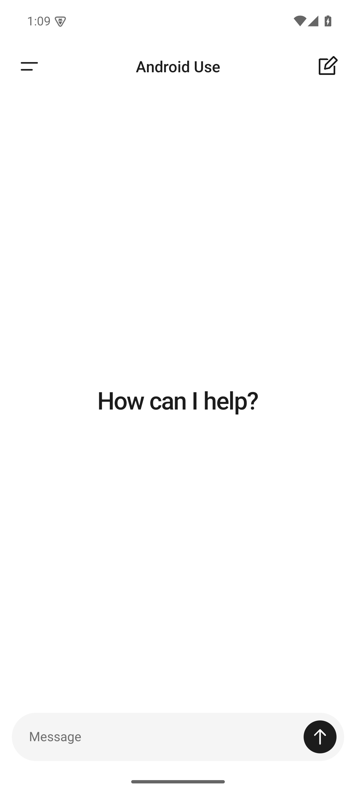
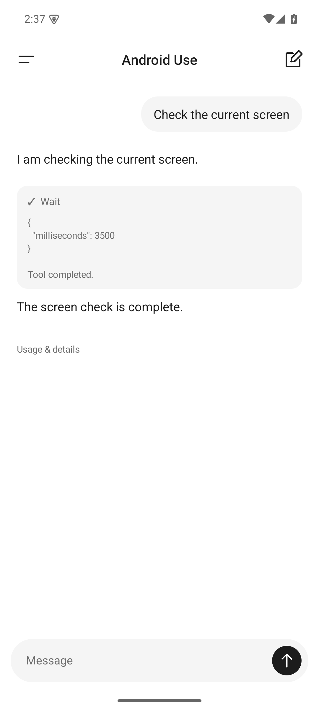
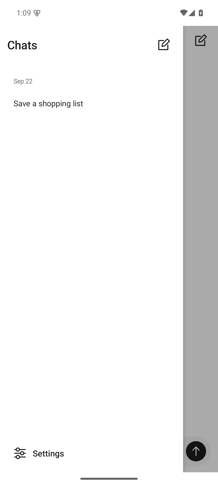
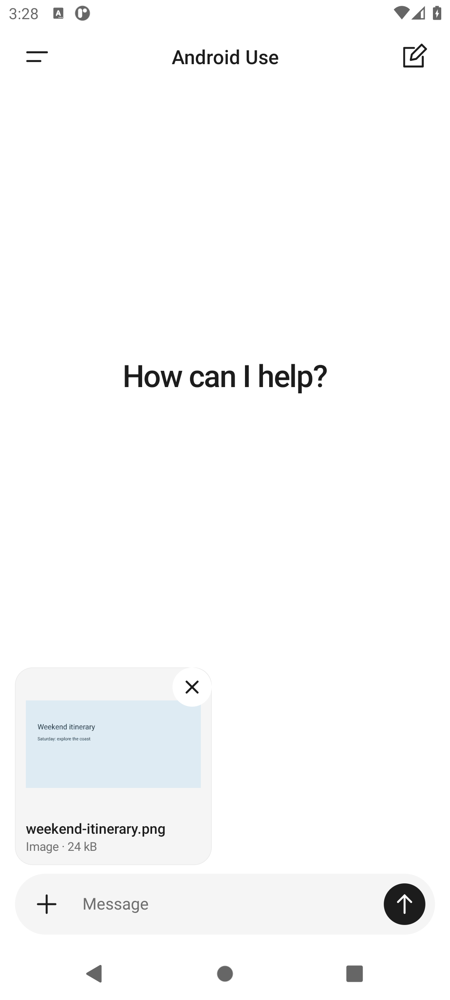
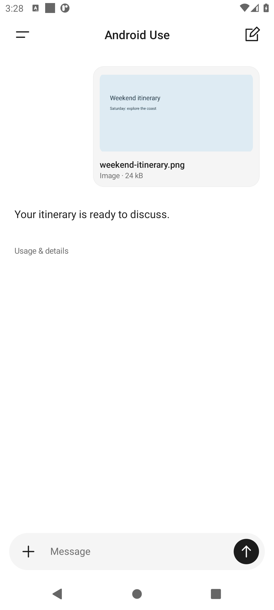

# Android Use

[Download the signed v0.4.0 APK](https://github.com/j0taaa/android-use/releases/download/v0.4.0/android-use-0.4.0.apk) · [Releases](https://github.com/j0taaa/android-use/releases) · [Installation page](https://android-use.jaypussy.site)

GitHub release downloads do not depend on a development computer. The installation-page mirror requires its hosting PC to stay online.

A standalone Android phone agent. The agent loop and accessibility tools run on the phone; inference goes directly to the model API you configure. No ADB, root, computer, JavaScript development server, or Android Use backend is needed after installation.

This is an early usable release, not a claim of reliable automation in every app. It includes OpenAI-compatible and Anthropic providers, structured screen observations, screenshots, semantic taps, coordinate gestures, text entry, app launching, navigation, a native foreground service, Pause/Stop controls, and encrypted local task history.

## Chat interface

Open directly to a new chat. Send a message from the bottom composer, swipe right (or tap the menu) to find earlier conversations, and open Settings from the drawer. Agent messages and phone actions appear directly in the conversation. Action cards show progress and outcomes; tap a card for its details. Token usage remains under **Usage & details**.

  

Screenshots show sample conversation data.

The drawer follows your finger, settles according to swipe speed, and fades its backdrop. Switching chats crossfades the conversation while keeping the header and composer in place, and restores each chat’s draft and scroll position during the activity’s lifetime. Controls and new question/completion messages provide light haptic feedback, respecting Android settings. Animations respect the system animation setting.

You can send follow-up messages in chats created with v0.2 or later. The app reloads the encrypted provider transcript and appends new messages without rewriting earlier context. Keep the same provider, endpoint and model for that chat. Older v0.1 history remains readable; start a new chat for replies.

## Images and files

 

Tap **+** beside the message field and choose **Photos** or **Files**. Select one or several items through Android’s document picker. Preview or remove attachments before sending; a message can contain attachments without any text. Sent attachments appear in the chat and remain available to the model in follow-ups and replies to agent questions.

- Images: Android-supported bitmap formats, including JPEG, PNG, WebP and HEIC. Images are normalized once to JPEG, at most 1600 pixels on the longer edge. Animated images send their first frame.
- PDFs: sent as native PDF input to the selected provider. The model and endpoint must support PDF input.
- Text, Markdown, CSV, JSON, XML, HTML, YAML and common source files: UTF-8 text, up to 100,000 characters and 200 KB source size.
- DOCX: extracted main-document text only, up to 100,000 characters; embedded images, formatting, headers and footers are not included. Other binary formats, audio and video are not supported yet.

Up to four attachments per message, totaling 4 MiB after preparation. Image source files can be up to 20 MiB; PDF and DOCX sources up to 4 MiB. Large or unsupported files show an error before sending. DOCX decompression is bounded. Provider-specific page counts, context windows and file limits still apply. OpenAI-compatible endpoints vary in image/PDF support; text attachments work with text models that support tools.

Preparation runs off the UI thread. File content, names and thumbnails are encrypted locally with Android Keystore. Attachment drafts survive rotation, chat switching and process recreation. The app copies selected content into private storage, so it does not need broad storage permission or continued access to the original file. **Delete chat history** also deletes attachment drafts and stored payloads.

Attachments go directly to your configured inference endpoint when you send. They are appended once to the provider transcript, preserving earlier request content for caching. They are model inputs; this feature does not upload the files into other phone apps automatically.

References: [OpenAI file input formats](https://developers.openai.com/api/docs/guides/file-inputs), [Anthropic PDF input](https://platform.claude.com/docs/en/build-with-claude/pdf-support).

## Install and use

1. Install the signed APK on an Android 11+ phone.
2. Swipe right or tap the menu, then open **Settings**. Choose a provider, API base URL, model ID, and your API key. The default is OpenAI-compatible, `https://api.openai.com/v1`, `gpt-4.1-mini`. Use a model supporting function calls; image input is needed for screenshots. Anthropic defaults to `https://api.anthropic.com/v1`, `claude-sonnet-4-6`.
3. Save the connection. **Test connection** sends one small billable model request.
4. Read the phone-control disclosure and enable **Android Use phone control** in Android Accessibility settings. If Android blocks a sideloaded accessibility service, use the app's system **App info → ⋮ → Allow restricted settings**, then return to Accessibility.
5. Keep the phone unlocked. Start with “Open Android Use practice and save a note saying Hello from my phone.” The practice activity is a real notepad UI that changes in response to accessibility actions.
6. Use the floating controls or persistent notification to pause or stop. Open the app to answer an agent question. A dispatched gesture may complete, but stopping cancels inference and blocks later dispatches.

The release APK contains no API key or predefined test-provider configuration. Each user's configuration is local. HTTPS is required for remote endpoints. Loopback HTTP is supported for local providers and emulator development.

## Caching and cost

The agent is implemented in Kotlin rather than Pi. The original research plan considered Pi first; the user clarified that framework choice is flexible and caching is the requirement. A small native loop avoids a JavaScript service-lifecycle bridge and exposes all request construction for testing.

- System instructions and the ordered tool schema remain fixed.
- Conversation messages are appended. Existing screen observations, assistant calls, tool results, and image blocks are never regenerated or moved.
- OpenAI requests use a stable `prompt_cache_key` on the official endpoint. Compatible endpoints receive standard Chat Completions requests without OpenAI-specific cache settings.
- Anthropic requests enable automatic ephemeral prompt caching through top-level `cache_control`.
- Screenshots can be disabled in settings, are requested as a tool, and limited to five per message. Text observations are bounded to 160 visible meaningful nodes.
- **Usage & details** shows **provider-reported** input, output, cache-read, and cache-write tokens. Input limits include cached tokens and are checked between requests; one request can cross the budget.
- Default limits are 24 model turns per user message, 10,000,000 cumulative input tokens per user message, a 15-minute run deadline checked between turns, and 8 million characters of serialized conversation (including attachment data). There is no hidden automatic context rewriting. Send a follow-up to continue within a new run budget; start a new chat if the conversation reaches the context-size limit.

The v0.3 upgrade changes a stored 100,000-token default to 10,000,000 once. Other saved limits are preserved, and you can still edit the budget in Settings.

Cache hits are determined by the provider, selected model, prefix length, expiry, and routing. Stable requests enable reuse but cannot guarantee it. This repository tests prefix preservation; it does not claim measured live-provider savings.

References: [OpenAI prompt caching](https://developers.openai.com/api/docs/guides/prompt-caching), [Anthropic prompt caching](https://platform.claude.com/docs/en/build-with-claude/prompt-caching).

## Architecture

- `AgentCore.kt`: provider-neutral tool contracts, provider-native append-only conversations, schema checks, HTTP clients, usage parsing.
- `AgentService.kt`: native foreground run owner, sequential execution, pause/question/stop states, budgets and durable action journal.
- `PhoneAccessibilityService.kt`: window observations, unique references per snapshot, target revalidation, gestures, screenshots and Android actions.
- `Attachments.kt`: bounded file import, image normalization, DOCX extraction, encrypted attachment payloads and persistent draft references.
- `Storage.kt`: Android Keystore AES-GCM encryption for API credentials and complete session files; atomic file replacement for journal writes.
- `MainActivity.kt`, `ChatViews.kt`, `Ui.kt`: native light chat, keyboard-aware composer, swipe drawer, settings and accessibility overlay.
- `PracticeActivity.kt`: harmless UI for manual and automated phone-control tests.

Accessibility performs the phone operations. The model only proposes tool calls; there is no remote execution server. A provider interface can later wrap native on-device inference without changing the tools.

Nodes are scoped to a screen snapshot, with fresh-tree validation before actions. Only one tool call is accepted per model response. Multi-call batches are rejected without executing any member. An observed action result is distinct from the model's task-completion judgment.

The app persists action intent before dispatch. Android process death can leave the external effect uncertain; the next launch marks that session **INTERRUPTED** and does not replay it. There is no automatic continuation after process death. On an explicit follow-up, any unresolved tool call gets an interruption result, followed by a fresh observation. The previous action is never replayed automatically.

## Privacy and limits

Screen text, requested images and chat attachments go to the configured inference endpoint. History and credentials are encrypted locally, excluded from cloud backup/device transfer, and not sent to an Android Use service. The app's own control/credential screens are excluded from agent observations and screenshot tools. API credentials never enter prompts or task reports. Shared reports omit task text and screen contents.

The user explicitly enables accessibility and initiates each task. The model is instructed to treat screen content as untrusted data and ask for missing authorization. This is not a guarantee against prompt injection; task supervision is appropriate for an early release. Password entry, screen unlocking, protected screenshots, and some custom-drawn controls require manual handling. The app does not implement scheduled unattended tasks, local models, a custom keyboard, or automatic recovery/resume after process death.

Current [Google Play accessibility policy](https://support.google.com/googleplay/android-developer/answer/10964491?hl=en) constrains general autonomous phone agents, so this release is distributed as a directly installable APK.

## Build

Requirements: JDK 17, Android SDK platform 35 and build-tools 34.0.0 or AGP's selected version, and network access for the pinned Gradle dependencies.

```bash
export JAVA_HOME=/usr/lib/jvm/java-17-openjdk-amd64
export ANDROID_HOME="$HOME/Android/Sdk"
./gradlew :app:assembleDebug :app:testDebugUnitTest :app:lintDebug
```

The Gradle wrapper is checked in. Debug package: `dev.androiduse.app.debug`. Release package: `dev.androiduse.app`. The native JVM app has no CPU-specific shared library requirement, so the release APK supports both ARM phones and x86 emulators.

For a release, create a private keystore and an ignored `signing.properties`:

```properties
storeFile=/absolute/path/to/release.jks
storePassword=YOUR_PRIVATE_PASSWORD
keyAlias=android-use
keyPassword=YOUR_PRIVATE_PASSWORD
```

```bash
./gradlew :app:assembleRelease
```

Keep the signing key safe: future updates must use the same key. Signing credentials and generated artifacts are excluded from the repository.

## Emulator and tests

The SDK was installed at `~/Android/Sdk`. Run the provisioned emulator with:

```bash
~/Android/Sdk/emulator/emulator -avd AndroidUse_API35 -gpu swiftshader_indirect -memory 2048 -cores 2
```

Add `-no-window -no-audio` for headless use. Hardware acceleration uses `/dev/kvm`.

```bash
./gradlew :app:testDebugUnitTest
./gradlew :app:connectedDebugAndroidTest
# Instrument the actual signed release variant:
./gradlew -PtestBuildType=release :app:testReleaseUnitTest :app:connectedReleaseAndroidTest :app:lintRelease
```

Instrumented tests enable accessibility on the emulator using the test harness, exercise actual Android windows, and use a local scripted HTTP server for repeatable model responses. This server exists only in the test APK; it is not bundled into the app. The tests cover real controls, cross-app navigation, screenshot image payloads, stale-reference rejection, prefix preservation, cache usage parsing, encrypted credentials, cancellation, pause/resume, Anthropic question/reply behavior, exclusion of the agent's own controls, encrypted chat continuation, UI message sending, drawer navigation, rotation, keyboard layout, live inline action states, conversation draft restoration, token-default migration, real document-picker selection, attachment removal/rotation, image-only sends, attachment prefix preservation, document extraction and encrypted file storage. See [docs/TESTING.md](docs/TESTING.md) for recorded results and limitations.

## Research

[PLAN.md](PLAN.md) preserves the initial research into Deft and Pi. Its React Native/Pi stack proposal is superseded by this implementation's native Kotlin choice; unimplemented milestones in that document are future work, not shipped features.
